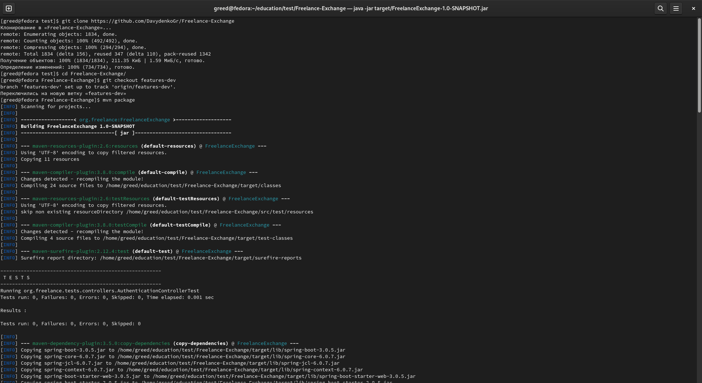
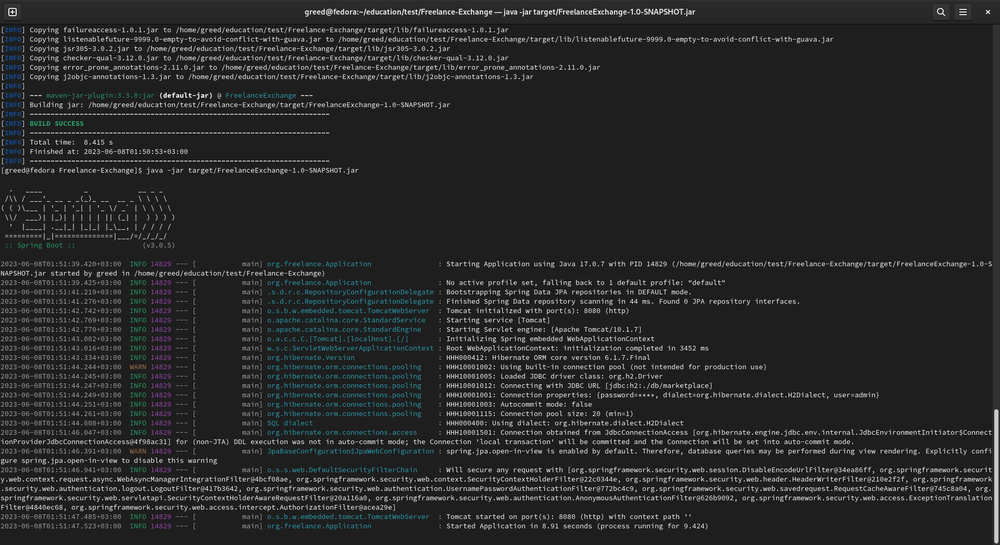
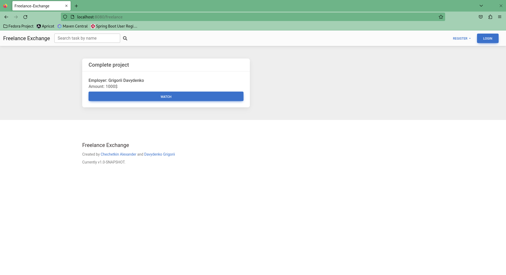

# FREELANCE EXCHANGE
### About project

Freelance Exchange is web application which helps employers to find employee and help employee to find paid job.

Create tasks according to your goals and choose any you want.

### Requirements

- Java version 11
- Maven - build and management tool for Java-projects

### Usage
#### Step 1: Installation

Before all, clone project in your workspace and run mvn package command in your terminal:

```
git clone https://github.com/DavydenkoGr/Freelance-Exchange
cd Freelance-Exchange
mvn package
```

#### Step 2: Run application

The next step is to run project using java -jar command:

```
java -jar target/FreelanceExchange-1.0-SNAPSHOT.jar
```

#### Step 3: Start working

Now you can open application on local host using next url:

```
http://localhost:8080/freelance
```

### Usage examples
#### Installation and launch





#### Website



### Authors:

- *Chechetkin Alexander*
    - GitHub: *@Prosto-Sasha*
    - Telegram: *@snakemanysss*
- *Davydenko Grigorii*
    - GitHub: *@DavydenkoGr*
    - Telegram: *@desertSmoke42*
